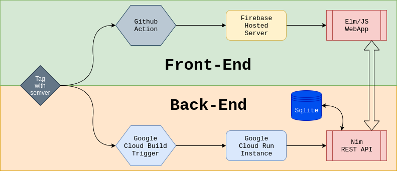

# [VERBLY](https://verbly.3digit.dev)

## What is this?
Verbly is a webapp I designed to help myself and others practice one of the more
difficult parts of learning one of the latin-based languages:  Verb Conjugation.

In any non-english latin language, you have to conjugate verbs based on the subject
that the verb refers to:
- I
- You (singular)
- They (singular)
- We
- You (plural)
- They (plural)

Memorizing all the conjugations and knowing which one to use can be a tough part
of learning a language, so this app is designed to provide multiple ways to learn.

## Features

### Translate
This feature allows the user to search for verbs in multiple ways to learn more about
the conjugations.

You can "Conjugate", where you enter an English verb (or a partial search), and
it will tell you what the conjugations of that verb are in a clean table.

You can also "Unconjugate", where you enter a conjugated version of a verb in the language,
and it will show you all conjugation forms for that verb, along with the English definition.

### Time Attack
This feature is a time-based mini-game.  You are presented a verb in English, a
subject (in the language you're learning), and 3 choices of conjugations of that verb.
You have to select the correct conjugation by clicking on it.  You are given a certain amount
of time to guess, and when the time is up you are given your score!  Each time you select, you
will also be told whether you got the answer correct, and what the correct answer is
if you got it wrong.

## Tech Details

### Front-End
The front-end of the app is built with [Elm](https://elm-lang.org/), and then compiled
down into JavaScript.

### Back-End
The app runs based on calls to a REST API served up by [Nim](https://nimlang.org/) using
the [Jester](https://github.com/dom96/jester) framework, reading the verbs and
conjugations from a SQLite Database.

### CI/CD
The app runs based off of tagging this repository with Semantic Versioning (v#.#.#).

